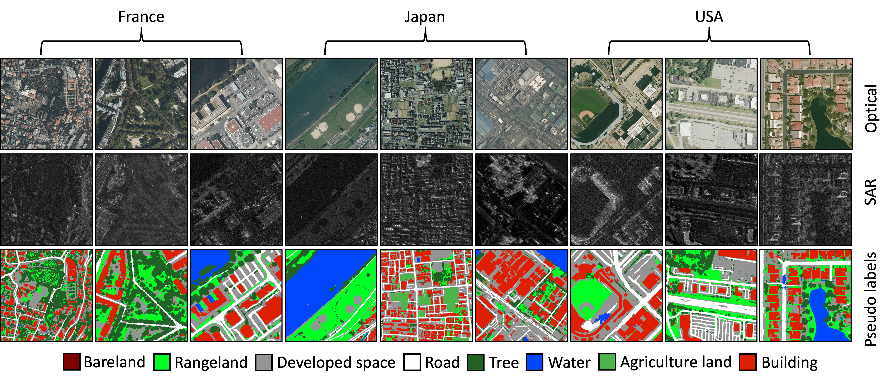

<div align="justify">
	
## OpenEarthMap-SAR
<p align="justify">
The <a href="https://arxiv.org/abs/2501.10891v2">OpenEarthMap Synthetic Aperture Radar</a> (OpenEarthMap-SAR) is a high-resolution SAR benchmark dataset for land cover mapping under all-weather conditions. The motivation of this benchmark dataset is to facilitate advancements in SAR-based geospatial analysis for global high-resolution land cover mapping. 
</p> 
<p>	
The OpenEarthMap-SAR dataset was served as the official dataset for the <a href="https://www.grss-ieee.org/technical-committees/image-analysis-and-data-fusion/?tab=data-fusion-contest">2025 IEEE GRSS Data Fusion Contest Track 1</a> organized by the IEEE GRSS Image Analysis and Data Fusion Technical Committee, the University of Tokyo, RIKEN, and ETH Zurich. The contest aims to foster the development of innovative solutions for all-weather land cover and building damage mapping using multimodal SAR and optical EO data at submeter resolution. Check out the winners of the contest at <a href="https://www.grss-ieee.org/community/technical-committees/winners-of-the-2025-ieee-grss-data-fusion-contest-all-weather-land-cover-and-building-damage-mapping/">here</a>.
</p>
<!-- <p></p> -->
</div>

<div align="center">
	
[](https://github.com/Naereen/StrapDown.js/blob/master/LICENSE)
<a href="https://pytorch.org/get-started/locally/"></a>

</div>


## Dataset
<div align="justify">
<p>	
The OpenEarthMap-SAR dataset consists of 1.5 million segments of 5033 aerial and satellite images covering 35 regions from Japan, France and the USA; and with partially manually annotated labels and fully pseudo labels of 8 land cover classes. Each image has a size of 1024x1024 pixels at a ground sampling distance of 0.15m--0.5m. The dataset has been made publicly available at <a href="https://zenodo.org/records/14622048">Zenodo</a>, where you can download it. Below are examples of the dataset.
</p>
<p></p>
</div>

<!-- ## IEEE GRSS DFC2025
<div align="justify">
<p>	
The OpenEarthMap-SAR dataset was served as the official dataset for the <a href="https://www.grss-ieee.org/technical-committees/image-analysis-and-data-fusion/?tab=data-fusion-contest">2025 IEEE GRSS Data Fusion Contest Track 1</a> organized by the IEEE GRSS Image Analysis and Data Fusion Technical Committee, the University of Tokyo, RIKEN, and ETH Zurich. The contest aims to foster the development of innovative solutions for all-weather land cover and building damage mapping using multimodal SAR and optical EO data at submeter resolution. Check out the winners of the contest at <a href="https://www.grss-ieee.org/community/technical-committees/winners-of-the-2025-ieee-grss-data-fusion-contest-all-weather-land-cover-and-building-damage-mapping/">here</a>.
</p>
</div> -->

## Baseline Models
<div align="justify">
<p>The baseline models for three different tasks (semantic segmentation, UDA, and image translation) on the OpenEarthMap-SAR benchmark dataset are provided as follows.</p>

### Semantic Segmentation
<p>Yon can download all the pre-trained basleine models for the semantic segmentation task from <a href="https://drive.google.com/drive/folders/138jNYpgIey8uNOVLoW6p9dA1A5dhr8_K?usp=drive_link">here</a>.</p>
<table align="center">
    <!-- U-Net Optical -->
    <tr align="center">
        <th>Method</th>
        <th>Modality</th> 
	    <th>Labelling Scenario</th> 
	    <th>mIoU</th>
        <th>Pretrained</th> 
    </tr>
    <tr align="center">
        <td rowspan="9">U-Net with EfficientNet-B4</td>
        <td rowspan="3"> Optical </td> 
	    <td align="left"> Pseudo labels</td> 
	    <td> 56.56 </td> 
	    <td> <a href="https://drive.google.com/file/d/1tsbFhc0ukHggocr7dAzbRs6FMPFnQiMG/view?usp=drive_link">Download</a> </td> 
    </tr>
     <tr align="center">
	    <td align="left"> Pseudo labels + 5 real labels per region</td> 
	    <td> 58.19 </td> 
	    <td> <a href="https://drive.google.com/file/d/1hyHlC6stjt4OQ9BWXIv4OP87YkOLpQHr/view?usp=drive_link">Download</a> </td> 
    </tr>
     <tr align="center">
	    <td align="left"> Only 5 real labels per region</td> 
	    <td> 65.10 </td> 
	    <td> <a href="https://drive.google.com/file/d/16REK9OcnhzrUte68hnBj7SJCqLpt1c_U/view?usp=drive_link">Download</a> </td> 
    </tr>
    <!-- U-Net SAR -->
    <tr align="center">
        <td rowspan="3"> SAR </td> 
	    <td align="left"> Pseudo labels</td> 
	    <td> 35.13 </td> 
	    <td> <a href="https://drive.google.com/file/d/1hvgJIWttGg-NloVfeQiXIoFi26RvAUVg/view?usp=drive_link">Download</a> </td> 
    </tr>
     <tr align="center">
	    <td align="left"> Pseudo labels + 5 real labels per region</td> 
	    <td> 36.84 </td> 
	    <td> <a href="https://drive.google.com/file/d/1BSe2ywsFbAcf0CS_7j9_fvWTe5Z89TlC/view?usp=drive_link">Download</a> </td> 
    </tr>
     <tr align="center">
	    <td align="left"> Only 5 real labels per region</td> 
	    <td> 33.86 </td> 
	    <td> <a href="https://drive.google.com/file/d/1Iy_VE6LpoUfOuLFM8V54WTmSSKBOKNwm/view?usp=drive_link">Download</a> </td> 
    </tr>
    <!-- U-Net Optical+SAR -->
    <tr align="center">
        <td rowspan="3">SAR + Optical</td> 
	    <td align="left">Pseudo labels</td> 
	    <td> 56.32 </td> 
	    <td> <a href="https://drive.google.com/file/d/1AFRU0sreULHzb2fCCTag8Jjx6XxJUUiw/view?usp=drive_link">Download</a> </td> 
    </tr>
    <tr align="center">
	    <td align="left">Pseudo labels + 5 real labels per region</td> 
	    <td> 49.79 </td> 
	    <td> <a href="https://drive.google.com/file/d/18Y_NHJ78zT5lOL5h_muCNtrivu6aLl4V/view?usp=drive_link">Download</a> </td> 
    </tr>
    <tr align="center">
	    <td align="left"> Only 5 real labels per region</td> 
	    <td> 60.16 </td> 
	    <td> <a href="https://drive.google.com/file/d/1raL8qVwSSraqYBcvHO06yHHpw-vCkD_a/view?usp=drive_link">Download</a> </td> 
    </tr>
</table>
<b>Acknowledgement:</b> The code for the <a href="https://arxiv.org/abs/1505.04597">U-Net</a> with <a href="https://arxiv.org/abs/1905.11946">EfficientNet-B4</a> is borrowed from the <a href="https://github.com/qubvel-org/segmentation_models.pytorch">Segmentation Models Pytorch</a>. Thanks to the authors for making their code publically available.
<p>&nbsp;</p>


### UDA Semantic Segmentation
<p>Country-wise UDA task with France as the source domain and Japan and USA as target domains. 
Yon can download all the pre-trained basleine models for the UDA semantic segmentation task from <a href="https://drive.google.com/drive/folders/10LB26t1yw6T1uFPMwQBsRc5oUjWbAYJ4?usp=drive_link">here</a>.</p>
<table align="center">
    <tr align="center">
        <th>Method</th>
        <th>Modality</th> 
        <th>UDA Setup</th> 
	    <th>Labelling Scenario</th> 
	    <th>mIoU</th>
        <th>Pretrained</th> 
    </tr>
    <!-- Optical -->
    <tr align="center">
        <td rowspan="12"><a href="https://openaccess.thecvf.com/content/CVPR2022/papers/Hoyer_DAFormer_Improving_Network_Architectures_and_Training_Strategies_for_Domain-Adaptive_Semantic_CVPR_2022_paper.pdf">DAFormer</a></td>
        <td rowspan="4"> Optical </td> 
	    <td align="left" rowspan="2"> France-to-USA </td> 
	    <td align="left"> Pseudo labels</td> 
	    <td> 39.38 </td> 
	    <td> <a href="https://drive.google.com/file/d/1YLgYgTPcsnrsfh7OF0z1jjcETsfve-S5/view?usp=drive_link">Download</a> </td> 
    </tr>
    <tr align="center">
	    <td align="left"> Pseudo labels + 5 real labels per region</td> 
	    <td> 39.60 </td> 
	    <td> <a href="https://drive.google.com/file/d/1Ya8xiaFNbw7zh2SgHMHRxy4CKGf4vSCI/view?usp=drive_link">Download</a> </td> 
    </tr>
    <tr align="center">
	    <td align="left" rowspan="2"> France-to-Japan </td> 
	    <td align="left"> Pseudo labels</td> 
	    <td> 44.35 </td> 
	    <td> <a href="https://drive.google.com/file/d/1aiGa2yQ4EmalVFRpvaPEXdq4DqkjjIOP/view?usp=drive_link">Download</a> </td> 
    </tr>
    <tr align="center">
	    <td align="left"> Pseudo labels + 5 real labels per region</td> 
	    <td> 43.74 </td> 
	    <td> <a href="https://drive.google.com/file/d/1uSkQgX_2SHwzESSyxZ1KlA_NAbrqFtsq/view?usp=drive_link">Download</a> </td> 
    </tr>
    <!-- SAR -->
   <tr align="center">
        <td rowspan="4"> SAR </td> 
	    <td align="left" rowspan="2"> France-to-USA </td> 
	    <td align="left"> Pseudo labels</td> 
	    <td> 19.35 </td> 
	    <td> <a href="https://drive.google.com/file/d/1757Jxecp5SVaXuYNMK0zYqfmjQE73Inr/view?usp=drive_link">Download</a> </td> 
    </tr>
    <tr align="center">
	    <td align="left"> Pseudo labels + 5 real labels per region</td> 
	    <td> 21.26 </td> 
	    <td> <a href="https://drive.google.com/file/d/1OGX4xhr32gzuAYmZt8rlMipmnbk6LXVS/view?usp=drive_link">Download</a> </td> 
    </tr>
    <tr align="center">
	    <td align="left" rowspan="2"> France-to-Japan </td> 
	    <td align="left"> Pseudo labels</td> 
	    <td> 13.49 </td> 
	    <td> <a href="https://drive.google.com/file/d/1GkYX7zVCcmfmF7liWTCFIuJ50XoHO_a6/view?usp=drive_link">Download</a> </td> 
    </tr>
    <tr align="center">
	    <td align="left"> Pseudo labels + 5 real labels per region</td> 
	    <td> 12.50 </td> 
	    <td> <a href="https://drive.google.com/file/d/1Sc5HWtYDCZpWvcre8W0Tm-IufZLaAri4/view?usp=drive_link">Download</a> </td> 
    </tr>
    <!-- Optical+SAR -->
    <tr align="center">
        <td rowspan="4">SAR + Optical</td> 
	    <td align="left" rowspan="2"> France-to-USA </td> 
	    <td align="left"> Pseudo labels</td> 
	    <td> 40.45 </td> 
	    <td> <a href="https://drive.google.com/file/d/1xluCoIT-pMGR4AgmK0tMZIjGdj4YfWXi/view?usp=drive_link">Download</a> </td> 
    </tr>
    <tr align="center">
	    <td align="left"> Pseudo labels + 5 real labels per region</td> 
	    <td> 37.21 </td> 
	    <td> <a href="https://drive.google.com/file/d/1LRUQrMuzXbksluw1DFGVJy2kXSPYcwbB/view?usp=drive_link">Download</a> </td> 
    </tr>
    <tr align="center">
	    <td align="left" rowspan="2"> France-to-Japan </td> 
	    <td align="left"> Pseudo labels</td> 
	    <td> 40.03 </td> 
	    <td> <a href="https://drive.google.com/file/d/1MyZ7tMjy4NaDm3IAfKoJuOD8Ch4VitU9/view?usp=drive_link">Download</a> </td> 
    </tr>
    <tr align="center">
	    <td align="left"> Pseudo labels + 5 real labels per region</td> 
	    <td> 39.97 </td> 
	    <td> <a href="https://drive.google.com/file/d/1LGqMu7NRTiSojKvWfiFLKJfQXEfirZf5/view?usp=drive_link">Download</a> </td> 
    </tr>
</table>
<b>Acknowledgement:</b> The code for the UDA semantic segmentation task is borrowed from the <a href="https://github.com/lhoyer/DAFormer">DAFormer</a>. Thanks to the authors for making their code publically available.
<p>&nbsp;</p>


### Image Translation
<p>Yon can download all the pre-trained basleine models for the image translation task from <a href="https://drive.google.com/drive/folders/1TQIglCWyOOEMLf9pwYHVoetffaCvnwmw?usp=drive_link">here</a>.</p>
<table align="center">
    <tr align="center">
        <th>Method</th>
        <th>Task</th> 
        <th>Sub-Task</th> 
	    <th>Modality</th> 
	    <th>PSNR</th>
	    <th>SSIM</th>
        <th>Pretrained</th> 
    </tr>
    <!--  -->
    <tr align="center">
        <td rowspan="6"><a href="https://arxiv.org/abs/2007.15651">CUT</a></td>
	    <td rowspan="3" align="left"> RGB Generation </td> 
        <td align="left"> Pseudo Semantic2RGB </td> 
	    <td align="left"> Pseudo Semantic Map</td> 
	    <td> 4.62 </td> 
	    <td> 0.2799 </td> 
	    <td> <a href="https://drive.google.com/drive/folders/1H-yENaO-LrpwXuN3sG0ksAKuBfn5Ca-K?usp=drive_link">Download</a> </td> 
    </tr>
    <tr align="center">
        <td align="left"> Real Semantic2RGB </td> 
	    <td align="left"> Real Semantic Map </td> 
	    <td> 14.57 </td> 
	    <td> 0.2141 </td> 
	    <td> <a href="https://drive.google.com/drive/folders/10xPg1L2WLHnw_ji-INrsLH-HwwOUHG0D?usp=drive_link">Download</a> </td> 
    </tr>
    <tr align="center">
        <td align="left"> SAR2RGB </td> 
	    <td align="left"> SAR </td> 
	    <td> 12.47 </td> 
	    <td> 0.1075 </td> 
	    <td> <a href="https://drive.google.com/drive/folders/1fsABom2c4lwflLdrVXLp6cUcIV9vZvW7?usp=drive_link">Download</a> </td> 
    </tr>
    <!--  -->
       <tr align="center">
	    <td rowspan="3" align="left"> SAR Generation </td> 
        <td align="left"> Pseudo Semantic2SAR </td> 
	    <td align="left"> Pseudo Semantic Map</td> 
	    <td> 9.48 </td> 
	    <td> 0.0213 </td> 
	    <td> <a href="https://drive.google.com/drive/folders/1at81X_upRHHMZZgIwknF96XfwBZF3ooo?usp=drive_link">Download</a> </td> 
    </tr>
    <tr align="center">
        <td align="left"> Real Semantic2SAR </td> 
	    <td align="left"> Real Semantic Map </td> 
	    <td> 9.27 </td> 
	    <td> 0.0239 </td> 
	    <td> <a href="https://drive.google.com/drive/folders/1jhITJcppFZdU85Wf6gP3xQ1XBYcwt8Ys?usp=drive_link">Download</a> </td> 
    </tr>
    <tr align="center">
        <td align="left"> RGB2SAR </td> 
	    <td align="left"> RGB </td> 
	    <td> 9.18 </td> 
	    <td> 0.0292 </td> 
	    <td> <a href="https://drive.google.com/drive/folders/1pbUq3zFyCXDKsvW4rWYsLi4ctLZ6pn9I?usp=drive_link">Download</a> </td> 
    </tr>
</table>
<b>Acknowledgement:</b> The code for the image translation task is borrowed from the <a href="https://github.com/taesungp/contrastive-unpaired-translation">Contrastive Unpaired Translation (CUT)</a>. Thanks to the authors for making their code publically available.
<p>&nbsp;</p>

<!-- with different SSL methods are provided as follows (13 bands of S2-L1C, 100 epochs, input clip to [0,1] by dividing 10000).

The PSPNet architecture with EfficientNet-B4 encoder from the [Segmentation Models Pytorch](https://github.com/qubvel/segmentation_models.pytorch?tab=readme-ov-file) GitHub repository is adopted as a baseline network.
The network was pretrained using the *trainset* with the [Catalyst](https://catalyst-team.com/) library. Then, the state-of-the-art framework called [distilled information maximization](https://arxiv.org/abs/2211.14126) 
(DIaM) was adopted to perform the GFSS task. The code in this repository contains only the GFSS portion. As mentioned by the baseline authors, any pretrained model can be used with their framework. 
The code was adopted from [here](https://github.com/sinahmr/DIaM?tab=readme-ov-file). To run the code on the *valset*, simply clone this repository and change your directory into the `OEM-Fewshot-Challenge` folder which contains the code files. Then from a terminal, run the `test.sh` script. as:
```bash
bash test.sh 
```
The results of the baseline model on the *valset* are presented below. To reproduce the results, download the pretrained models from [here](https://drive.google.com/file/d/1eLjfUJ2ajAMkJKCsoJr-MGSSzZ-LqDbR/view?usp=sharing). 
Follow the instructions in the **Usage** section, then run the `test.sh` script as explained. 

The weighted mIoUs are calculated using `0.4:0.6 => base:novel`. These weights are derived from the state-of-the-art results presented in the baseline paper. -->

</div>


<!-- Acknowledgement
This code is heavily borrowed from MRF-UNet and DAFormer. Thanks to the authors for making their code publically available.

License
This work is licensed under the MIT License, however, please refer to the licences of the MRF-UNet and DAFormer if you are using this code for commercial matters. -->

## Citation
<div align="justify">
For any scientific publication using this data, the following paper should be cited:
<pre style="white-space: pre-wrap; white-space: -moz-pre-wrap; white-space: -pre-wrap; white-space: -o-pre-wrap; word-wrap: break-word;">
@article{xia2025openearthmap,
  title   = {OpenEarthMap-SAR: A Benchmark Synthetic Aperture Radar Dataset for Global High-Resolution Land Cover Mapping},
  author  = {Xia, Junshi and Chen, Hongruixuan and Broni-Bediako, Clifford and Wei, Yimin and Song, Jian and Yokoya, Naoto},
  journal = {arXiv preprint arXiv:2501.10891},
  year    = {2025}
}
</pre>
</div>


## Acknowledgements
<div align="justify">

We are most grateful to the authors of [DIaM](https://github.com/sinahmr/DIaM?tab=readme-ov-file), [Semantic Segmentation PyTorch](https://github.com/qubvel/segmentation_models.pytorch?tab=readme-ov-file), 
and [Catalyst](https://catalyst-team.com/) from which the baseline code is built on.
</div>
