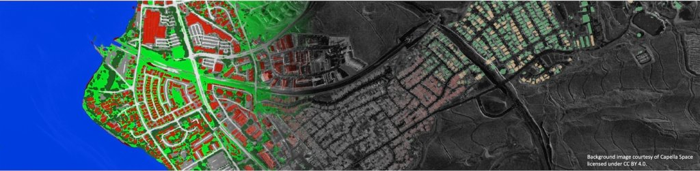

<div align="justify">
	
## OpenEarthMap Synthetic Aperture Radar Dataset 
<p align="justify">
This repository contains baseline models for <a href="https://arxiv.org/abs/2501.10891v2">OpenEarthMap Synthetic Aperture Radar</a> (OpenEarthMap-SAR) benchmark dataset for land cover mapping under all-weather conditions. The motivation of this benchmark dataset is to facilitate advancements in SAR-based geospatial analysis for global high-resolution land cover mapping. 
</p> 
<p></p>
</div>

<div align="center">
	
[](https://github.com/Naereen/StrapDown.js/blob/master/LICENSE)
<a href="https://pytorch.org/get-started/locally/"></a>

</div>


## Dataset
<div align="justify">
<p>	
The <a href="https://arxiv.org/abs/2501.10891v2">OpenEarthMap-SAR</a> is a synthetic aperture radar (SAR) benchmark dataset for global high-resolution land cover mapping under all weather conditions. The dataset consists of 1.5 million segments of 5033 aerial and satellite images covering 35 regions from Japan, France and the USA; and with partially manually annotated labels and fully pseudo labels of 8 land cover classes. Each image has a size of 1024x1024 pixels at a ground sampling distance of 0.15m--0.5m. The dataset has been made publicly available at <a href="https://zenodo.org/records/14622048">Zenodo</a>, where you can download it. Below are examples of the OpenEarthMap-SAR dataset.
</p>
<p></p>
</div>

## IEEE GRSS DFC2025
<div align="justify">
<p>	
The OpenEarthMap-SAR benchmark dataset was served as the official dataset for the <a href="https://www.grss-ieee.org/technical-committees/image-analysis-and-data-fusion/?tab=data-fusion-contest">2025 IEEE GRSS Data Fusion Contest Track 1</a> organized by the IEEE GRSS Image Analysis and Data Fusion Technical Committee, the University of Tokyo, RIKEN, and ETH Zurich. The contest aims to foster the development of innovative solutions for all-weather land cover and building damage mapping using multimodal SAR and optical EO data at submeter resolution. Check out the winners of the contest at <a href="https://www.grss-ieee.org/community/technical-committees/winners-of-the-2025-ieee-grss-data-fusion-contest-all-weather-land-cover-and-building-damage-mapping/">here</a>.
</p>
</div>

## Baseline Models
<div align="justify">
The baseline models for three different tasks on the OpenEarthMap-SAR benchmark dataset are provided as follows. Yon can download all the pre-trained parameters of the basleine models from <a href="">here</a>.

#### Semantic Segmentation
<table align="center">
    <!-- U-Net Optical -->
    <tr align="center">
        <th>Method</th>
        <th>Modality</th> 
	    <th>Labelling Scenario</th> 
	    <th>mIoU</th>
        <th>Pretrained</th> 
        <th>Acknowledgement</th> 
    </tr>
    <tr align="center">
        <td rowspan="9">UNet</td>
        <td> Optical </td> 
	    <td align="left"> Pseudo labels for all regions</td> 
	    <td> --- </td> 
	    <td> <a href="">Download</a> </td> 
	    <td align="left"> --- </td> 
    </tr>
     <tr align="center">
        <td> Optical </td> 
	    <td align="left"> Pseudo labels + 5 real labels per region</td> 
	    <td> --- </td> 
	    <td> <a href="">Download</a> </td> 
	    <td align="left"> --- </td> 
    </tr>
     <tr align="center">
        <td> Optical </td> 
	    <td align="left"> Only 5 real labels per region</td> 
	    <td> --- </td> 
	    <td> <a href="">Download</a> </td> 
	    <td align="left"> --- </td> 
    </tr>
    <!-- U-Net SAR -->
    <tr align="center">
        <td> SAR </td> 
	    <td align="left"> Pseudo labels for all regions</td> 
	    <td> --- </td> 
	    <td> <a href="">Download</a> </td> 
	    <td align="left"> --- </td> 
    </tr>
     <tr align="center">
        <td> SAR </td> 
	    <td align="left"> Pseudo labels + 5 real labels per region</td> 
	    <td> --- </td> 
	    <td> <a href="">Download</a> </td> 
	    <td align="left"> --- </td> 
    </tr>
     <tr align="center">
        <td> SAR </td> 
	    <td align="left"> Only 5 real labels per region</td> 
	    <td> --- </td> 
	    <td> <a href="">Download</a> </td> 
	    <td align="left"> --- </td> 
    </tr>
    <!-- U-Net Optical+SAR -->
    <tr align="center">
        <td> Optical + SAR </td> 
	    <td align="left"> Pseudo labels for all regions</td> 
	    <td> --- </td> 
	    <td> <a href="">Download</a> </td> 
	    <td align="left"> --- </td> 
    </tr>
     <tr align="center">
        <td> Optical + SAR</td> 
	    <td align="left"> Pseudo labels + 5 real labels per region</td> 
	    <td> --- </td> 
	    <td> <a href="">Download</a> </td> 
	    <td align="left"> --- </td> 
    </tr>
     <tr align="center">
        <td> Optical + SAR</td> 
	    <td align="left"> Only 5 real labels per region</td> 
	    <td> --- </td> 
	    <td> <a href="">Download</a> </td> 
	    <td align="left"> --- </td> 
    </tr>
   <!-- SegFormer Optical
    <tr align="center">
        <td rowspan="9">SegFormer</td>
        <td> Optical </td> 
	    <td align="left"> Pseudo labels for all regions</td> 
	    <td> --- </td> 
	    <td> <a href="">Download</a> </td> 
	    <td align="left"> --- </td> 
    </tr>
     <tr align="center">
        <td> Optical </td> 
	    <td align="left"> Pseudo labels + 5 real labels per region</td> 
	    <td> --- </td> 
	    <td> <a href="">Download</a> </td> 
	    <td align="left"> --- </td> 
    </tr>
     <tr align="center">
        <td> Optical </td> 
	    <td align="left"> Only 5 real labels per region</td> 
	    <td> --- </td> 
	    <td> <a href="">Download</a> </td> 
	    <td align="left"> --- </td> 
    </tr> -->
    <!-- SegFormer SAR
    <tr align="center">
        <td> SAR </td> 
	    <td align="left"> Pseudo labels for all regions</td> 
	    <td> --- </td> 
	    <td> <a href="">Download</a> </td> 
	    <td align="left"> --- </td> 
    </tr>
     <tr align="center">
        <td> SAR </td> 
	    <td align="left"> Pseudo labels + 5 real labels per region</td> 
	    <td> --- </td> 
	    <td> <a href="">Download</a> </td> 
	    <td align="left"> --- </td> 
    </tr>
     <tr align="center">
        <td> SAR </td> 
	    <td align="left"> Only 5 real labels per region</td> 
	    <td> --- </td> 
	    <td> <a href="">Download</a> </td> 
	    <td align="left"> --- </td> 
    </tr> -->
    <!-- SegFormer Optical+SAR
    <tr align="center">
        <td> Optical + SAR </td> 
	    <td align="left"> Pseudo labels for all regions</td> 
	    <td> --- </td> 
	    <td> <a href="">Download</a> </td> 
	    <td align="left"> --- </td> 
    </tr>
     <tr align="center">
        <td> Optical + SAR</td> 
	    <td align="left"> Pseudo labels + 5 real labels per region</td> 
	    <td> --- </td> 
	    <td> <a href="">Download</a> </td> 
	    <td align="left"> --- </td> 
    </tr>
     <tr align="center">
        <td> Optical + SAR</td> 
	    <td align="left"> Only 5 real labels per region</td> 
	    <td> --- </td> 
	    <td> <a href="">Download</a> </td> 
	    <td align="left"> --- </td> 
    </tr> -->
     <!-- VMamba Optical
    <tr align="center">
        <td rowspan="9">VMamba</td>
        <td> Optical </td> 
	    <td align="left"> Pseudo labels for all regions</td> 
	    <td> --- </td> 
	    <td> <a href="">Download</a> </td> 
	    <td align="left"> --- </td> 
    </tr>
     <tr align="center">
        <td> Optical </td> 
	    <td align="left"> Pseudo labels + 5 real labels per region</td> 
	    <td> --- </td> 
	    <td> <a href="">Download</a> </td> 
	    <td align="left"> --- </td> 
    </tr>
     <tr align="center">
        <td> Optical </td> 
	    <td align="left"> Only 5 real labels per region</td> 
	    <td> --- </td> 
	    <td> <a href="">Download</a> </td> 
	    <td align="left"> --- </td> 
    </tr> -->
    <!-- VMamba SAR
    <tr align="center">
        <td> SAR </td> 
	    <td align="left"> Pseudo labels for all regions</td> 
	    <td> --- </td> 
	    <td> <a href="">Download</a> </td> 
	    <td align="left"> --- </td> 
    </tr>
     <tr align="center">
        <td> SAR </td> 
	    <td align="left"> Pseudo labels + 5 real labels per region</td> 
	    <td> --- </td> 
	    <td> <a href="">Download</a> </td> 
	    <td align="left"> --- </td> 
    </tr>
     <tr align="center">
        <td> SAR </td> 
	    <td align="left"> Only 5 real labels per region</td> 
	    <td> --- </td> 
	    <td> <a href="">Download</a> </td> 
	    <td align="left"> --- </td> 
    </tr> -->
    <!-- VMamba Optical+SAR
    <tr align="center">
        <td> Optical + SAR </td> 
	    <td align="left"> Pseudo labels for all regions</td> 
	    <td> --- </td> 
	    <td> <a href="">Download</a> </td> 
	    <td align="left"> --- </td> 
    </tr>
     <tr align="center">
        <td> Optical + SAR</td> 
	    <td align="left"> Pseudo labels + 5 real labels per region</td> 
	    <td> --- </td> 
	    <td> <a href="">Download</a> </td> 
	    <td align="left"> --- </td> 
    </tr>
     <tr align="center">
        <td> Optical + SAR</td> 
	    <td align="left"> Only 5 real labels per region</td> 
	    <td> --- </td> 
	    <td> <a href="">Download</a> </td> 
	    <td align="left"> --- </td> 
    </tr> -->
</table>

#### UDA Semantic Segmentation
<!-- <table align="center">
    U-Net Optical
    <tr align="center">
        <th>Method</th>
        <th>Modality</th> 
	    <th>Labelling Scenario</th> 
	    <th>mIoU</th>
        <th>Pretrained</th> 
        <th>Acknowledgement</th> 
    </tr>
    <tr align="center">
        <td rowspan="9">UNet</td>
        <td> Optical </td> 
	    <td align="left"> Pseudo labels for all regions</td> 
	    <td> --- </td> 
	    <td> <a href="">Download</a> </td> 
	    <td align="left"> --- </td> 
    </tr>
     <tr align="center">
        <td> Optical </td> 
	    <td align="left"> Pseudo labels + 5 real labels per region</td> 
	    <td> --- </td> 
	    <td> <a href="">Download</a> </td> 
	    <td align="left"> --- </td> 
    </tr>
     <tr align="center">
        <td> Optical </td> 
	    <td align="left"> Only 5 real labels per region</td> 
	    <td> --- </td> 
	    <td> <a href="">Download</a> </td> 
	    <td align="left"> --- </td> 
    </tr>
    U-Net SAR
    <tr align="center">
        <td> SAR </td> 
	    <td align="left"> Pseudo labels for all regions</td> 
	    <td> --- </td> 
	    <td> <a href="">Download</a> </td> 
	    <td align="left"> --- </td> 
    </tr>
     <tr align="center">
        <td> SAR </td> 
	    <td align="left"> Pseudo labels + 5 real labels per region</td> 
	    <td> --- </td> 
	    <td> <a href="">Download</a> </td> 
	    <td align="left"> --- </td> 
    </tr>
     <tr align="center">
        <td> SAR </td> 
	    <td align="left"> Only 5 real labels per region</td> 
	    <td> --- </td> 
	    <td> <a href="">Download</a> </td> 
	    <td align="left"> --- </td> 
    </tr>
    U-Net Optical+SAR
    <tr align="center">
        <td> Optical + SAR </td> 
	    <td align="left"> Pseudo labels for all regions</td> 
	    <td> --- </td> 
	    <td> <a href="">Download</a> </td> 
	    <td align="left"> --- </td> 
    </tr>
     <tr align="center">
        <td> Optical + SAR</td> 
	    <td align="left"> Pseudo labels + 5 real labels per region</td> 
	    <td> --- </td> 
	    <td> <a href="">Download</a> </td> 
	    <td align="left"> --- </td> 
    </tr>
     <tr align="center">
        <td> Optical + SAR</td> 
	    <td align="left"> Only 5 real labels per region</td> 
	    <td> --- </td> 
	    <td> <a href="">Download</a> </td> 
	    <td align="left"> --- </td> 
    </tr>
</table> -->

#### Image Translation


<!-- with different SSL methods are provided as follows (13 bands of S2-L1C, 100 epochs, input clip to [0,1] by dividing 10000).

The PSPNet architecture with EfficientNet-B4 encoder from the [Segmentation Models Pytorch](https://github.com/qubvel/segmentation_models.pytorch?tab=readme-ov-file) GitHub repository is adopted as a baseline network.
The network was pretrained using the *trainset* with the [Catalyst](https://catalyst-team.com/) library. Then, the state-of-the-art framework called [distilled information maximization](https://arxiv.org/abs/2211.14126) 
(DIaM) was adopted to perform the GFSS task. The code in this repository contains only the GFSS portion. As mentioned by the baseline authors, any pretrained model can be used with their framework. 
The code was adopted from [here](https://github.com/sinahmr/DIaM?tab=readme-ov-file). To run the code on the *valset*, simply clone this repository and change your directory into the `OEM-Fewshot-Challenge` folder which contains the code files. Then from a terminal, run the `test.sh` script. as:
```bash
bash test.sh 
```
The results of the baseline model on the *valset* are presented below. To reproduce the results, download the pretrained models from [here](https://drive.google.com/file/d/1eLjfUJ2ajAMkJKCsoJr-MGSSzZ-LqDbR/view?usp=sharing). 
Follow the instructions in the **Usage** section, then run the `test.sh` script as explained. 

The weighted mIoUs are calculated using `0.4:0.6 => base:novel`. These weights are derived from the state-of-the-art results presented in the baseline paper. -->

</div>

## Usage
<div align="justify">

<!-- The repository consists of: a configuration file that can be found in `config/`; data splits for each set in `data/`; and  all the codes for the GFSS task are in `src/`. The testing script `test.sh` is at the root of the repo.
The `docs` folder contains only GitHub page files.

To use the baseline code, you first need to clone the repository and change your directory into the `OEM-Fewshot-Challenge` folder. Then follow the steps below:</br>
1. Install all the requirements. `Python 3.9` was used in our experiments. Install the list of packages in the `requirements.txt` file using `pip install -r requirements.txt`.
2. Download the dataset from [here](https://zenodo.org/records/10591939) into a directory that you set in the config file `oem.yaml`
3. Download the pretrained weights from [here](https://drive.google.com/file/d/1eLjfUJ2ajAMkJKCsoJr-MGSSzZ-LqDbR/view?usp=sharing) into a directory that you set in the config file `oem.yaml`
4. In the `oem.yaml` you need to set only the paths for the dataset and the pretrained weights. The other settings need not be changed to reproduce the results.
5. Test the model by running the `test.sh` script as mentioned in the **Baseline** section. The script will use the *support_set* to adapt and predict the segmentation maps of the *query_set*. After running the script, the results are provided in a `results` folder which contains a `.txt` file of the IoUs and mIoUs, and a `preds` and `targets` folder for the predicted and the targets maps, respectively.

You can pretrained your model using the *trainset* and any simple training scheme of your choice. The baseline paper used the [`train_base.py`](https://github.com/chunbolang/BAM/blob/main/train_base.py) script and base learner models of [BAM](https://github.com/chunbolang/BAM) (see the [baseline paper](https://github.com/sinahmr/DIaM?tab=readme-ov-file) for more info). -->
 
</div>

## Citation
<div align="justify">
For any scientific publication using this data, the following paper should be cited:
<pre style="white-space: pre-wrap; white-space: -moz-pre-wrap; white-space: -pre-wrap; white-space: -o-pre-wrap; word-wrap: break-word;">
@InProceedings{Xia_2023_WACV,
    author    = {Xia, Junshi and Yokoya, Naoto and Adriano, Bruno and Broni-Bediako, Clifford},
    title     = {OpenEarthMap: A Benchmark Dataset for Global High-Resolution Land Cover Mapping},
    booktitle = {Proceedings of the IEEE/CVF Winter Conference on Applications of Computer Vision (WACV)},
    month     = {January},
    year      = {2023},
    pages     = {6254-6264}
}
</pre>
</div>

<!-- ## Acknowledgements
<div align="justify">

We are most grateful to the authors of [DIaM](https://github.com/sinahmr/DIaM?tab=readme-ov-file), [Semantic Segmentation PyTorch](https://github.com/qubvel/segmentation_models.pytorch?tab=readme-ov-file), 
and [Catalyst](https://catalyst-team.com/) from which the baseline code is built on.
</div> -->
